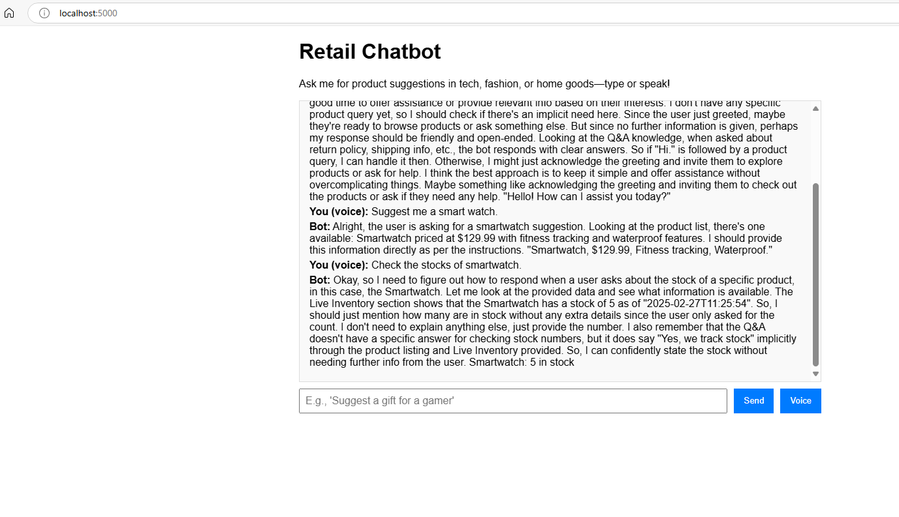

# Retail Chatbot with DeepSeek-R1

A generative AI-powered retail chatbot built with DeepSeek-R1, inspired by "The Rise of Generative AI Agents: Transforming Industries in 2025." Three flavors: a lightweight base (`main`), IoT/Kafka-enhanced (`kafka-iot-extension`), and now a voice-enabled, concise version (`voice-interface`).

  

*Voice input/output with real-time Kafka stock (voice-interface).*

## Branches
- **`main`**: Core chatbot with static product/FAQ data—simple and standalone.
- **`kafka-iot-extension`**: Adds real-time inventory via Kafka and IoT-like producers.
- **`voice-interface`**: Adds voice input/output and concise responses.

## Features
### Base Chatbot (main)
- Product suggestions from a static list (e.g., Wireless Earbuds, $49.99).
- FAQ answers (e.g., “What’s your return policy?”).
- In-context learning with DeepSeek-R1—no fine-tuning.

### Kafka + IoT Extension (kafka-iot-extension)
- Real-time inventory streaming via Kafka (e.g., “5 Smartwatches in stock”).

### Voice Interface (voice-interface)
- All above, plus:
- Voice input (STT) and output (TTS) via browser Web Speech API.
- Concise responses—no reasoning, just the answer (e.g., “Smartwatch, $129.99, fitness tracking, waterproof”).

## Tech Stack
- **LLM**: DeepSeek-R1 (7B) via Ollama
- **Backend**: Flask (Python)
- **Frontend**: HTML/JavaScript (Web Speech API for voice)
- **Streaming**: Apache Kafka + Zookeeper
- **Container**: Docker

## Setup (Local with Docker)
### Base Chatbot (main)
1. **Clone and Switch**:
   ```bash
   git clone https://github.com/dbh/retail-chatbot.git
   cd retail-chatbot
   git checkout main