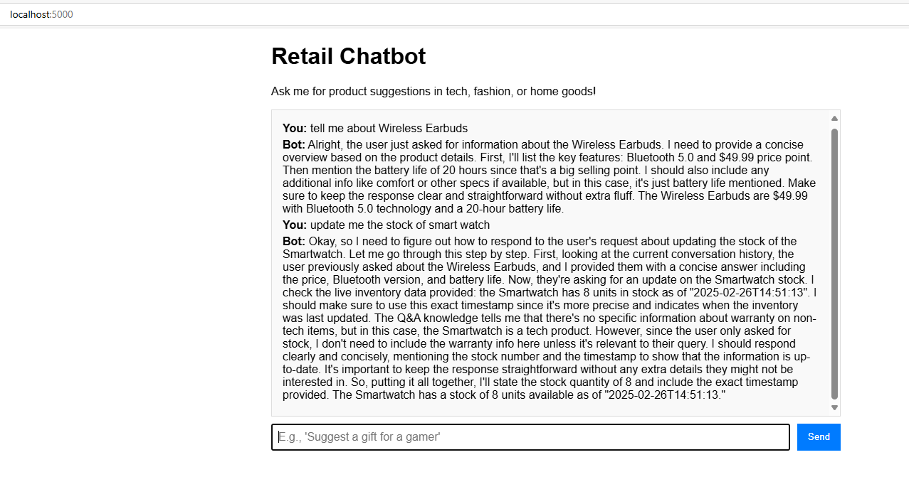

# Retail Chatbot with DeepSeek-R1

A generative AI-powered retail chatbot built with DeepSeek-R1, showcasing autonomous agents from "The Rise of Generative AI Agents: Transforming Industries in 2025." It suggests products (tech, fashion, home goods) and answers FAQs using *in-context learning*. Now enhanced with Kafka and IoT for real-time inventory updates!

![Chatbot Demo]
 
*Suggesting a tech gift with live stock info from Kafka.*

## Features
- **Product Suggestions**: Recommends from a curated list (e.g., Wireless Earbuds, $49.99).
- **FAQ Answers**: Handles queries like “What’s your return policy?”.
- **In-Context Learning**: Adapts to a custom dataset via prompts—no fine-tuning needed.
- **Real-Time Inventory (New!)**: Kafka streams live stock updates from IoT-like producers.
- **Responsive UI**: Shows “Bot is thinking...” during processing delays.
- **Cost-Optimized**: Runs locally with Ollama (zero API cost) or on AWS (~$0.30/hour with GPU).

## Tech Stack
- **LLM**: DeepSeek-R1 (7B params) via Ollama
- **Backend**: Flask (Python)
- **Frontend**: HTML/JavaScript
- **Streaming**: Apache Kafka (with Zookeeper)
- **Container**: Docker (handles all dependencies—no virtual env required)

## Setup (Local with Docker)
1. **Prerequisites**:
   - Docker Desktop installed ([Download](https://www.docker.com/products/docker-desktop/))
   - 8GB+ RAM (16GB+ recommended for smoother CPU inference)
   - Windows/macOS/Linux
2. **Clone the Repo**:
   ```bash
   git clone https://github.com/yourusername/retail-chatbot.git
3. **Run the App**
   cd retail_chatbot
   docker build -t retail-chatbot .
   docker run -d -p 5000:5000 retail-chatbot
4. **Test the App**
   Open http://localhost:5000
   Try: “Suggest a tech gift under $50” or “What’s your return policy?”
   Note: CPU inference may take 5-15s per reply; GPU (e.g., AWS) drops to 1-2s.


